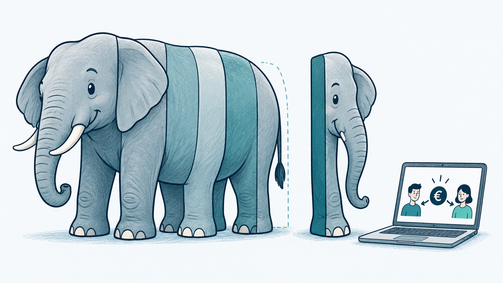
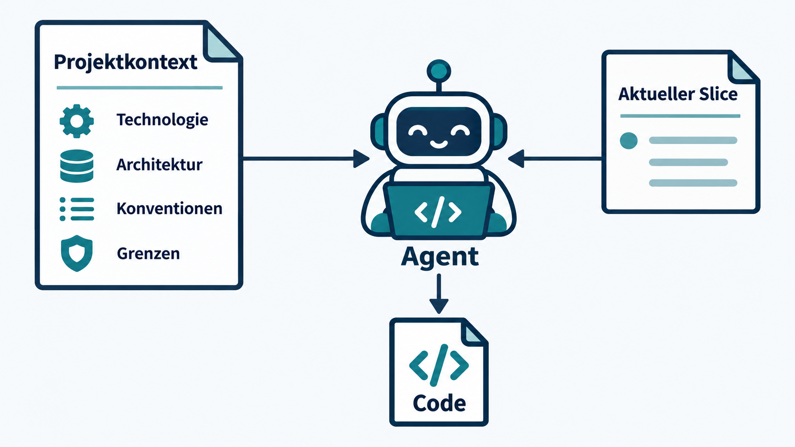

<!-- _class: lead -->
<!-- _paginate: false -->

# AI-Assisted Coding
## Staying in Control · Modul 2

Wie viel soll der Coding Agent für uns entscheiden?

**120 Minuten Coding-Dojo mit FairShare**

<!--
Folie 1 · 00:00–00:01. Willkommen und Leitfrage. Die Teilnehmenden entwickeln dieselbe Idee dreimal von null. Ziel: Unterschiede in der Zusammenarbeit erkennen, nicht FairShare fertigstellen.
Vorbereitung: Copilot Agent Mode oder vergleichbarer Coding Agent pro Team, Editor, freigegebener Modellzugang, lauffähige lokale Entwicklungsumgebung, sichtbarer Timer und gemeinsame Sammelfläche. Keine Projektvorlage vorgeben. Teams aus zwei oder drei Personen. Nur fiktive Personen und Ausgaben verwenden.
Inhaltsbasis: vom Nutzer bereitgestellte Modul-2-Outline, Stand 01.10.2026. Durchführungsplan: Trainer/modul-2-leitfaden.md. Kopierbare Aufgaben: arbeitsblatt-modul-2.md.
-->

---
# Heute ist ein Coding-Dojo

Gleiche Idee. Gleiche Teams. Gleicher Coding Agent.

| Runde | Unsere Arbeitsweise |
| :--- | :--- |
| **1 · One-shot** | Der Agent entscheidet den Weg |
| **2 · Slices** | Wir bestimmen den nächsten Schritt |
| **3 · Kontext + Slices** | Wir definieren zusätzlich den technischen Rahmen |

Jede Runde beginnt in einem **neuen, leeren Ordner und Chat**.
Wir lernen aus dem Vorgehen. Eine fertige App ist optional.

<!-- Folie 2 · 00:01–00:04. Ablauf: Setup bis 00:10, Runde 1 bis 00:25, Reflexion bis 00:35, Slicing-Impuls bis 00:45, Runde 2 bis 01:05, Reflexion bis 01:15, Kontext-Impuls bis 01:25, Runde 3 bis 01:45, Vergleich und Safari bis 01:57, Abschluss bis 02:00. Driver bedient den Agenten, Navigator beobachtet Entscheidungen und Änderungen. In Dreiergruppen dritte Person als Beobachter. Rollen je Runde wechseln. Alten Code behalten, aber nicht in die nächste Runde kopieren. Frischer Chat reduziert Übertrag aus vorherigen Runden. -->

---
# FairShare
## Gemeinsame Ausgaben unter Freunden aufteilen

Die Nutzer können …

- Personen hinzufügen und gemeinsame Ausgaben erfassen,
- angeben, wer bezahlt hat und wer beteiligt war,
- aktuelle Salden sehen,
- ermitteln, wer wem Geld zum Ausgleich zahlen sollte.

**Wie die Anwendung entsteht, ist zunächst offen.**

<!-- Folie 3 · 00:04–00:07. Keine Technologie, Architektur, Oberfläche oder Persistenz vorgeben. Diese Offenheit gehört zum Experiment. Rückfragen zum Produkt nur mit der hier sichtbaren Anforderung beantworten. FairShare wird in allen Runden mit derselben Produktidee gestartet. -->

---
# Was beobachten wir?

| Dimension | Unsere Frage |
| :--- | :--- |
| **Fortschritt** | Welche sichtbare Funktion ist entstanden? |
| **Verständnis** | Wie gut verstehen wir den entstandenen Code? |
| **Kontrolle** | Welche wichtigen Entscheidungen haben wir selbst getroffen? |
| **Ballast** | Welche unnötige Funktion oder Komplexität kam hinzu? |

Während der Runde: konkrete Beispiele notieren.
In der Reflexion: die Erfahrungen vergleichen.

<!-- Folie 4 · 00:07–00:10. Arbeitsblatt öffnen und Zugang prüfen. Keine Zahlen während des Codings verlangen. Beispiel für eine Beobachtung: Agent fügt Datenbank hinzu, ohne dass das Team Persistenz entschieden hat. Diese Dimensionen bleiben über alle Runden gleich. -->

---
<!-- _class: exercise compact -->
# Runde 1 · One-shot
## 15 Minuten · 00:10–00:25

> Baue eine kleine Anwendung namens FairShare zum Aufteilen von
> Ausgaben in einer Gruppe von Freunden.
>
> Nutzer sollen Personen hinzufügen, gemeinsame Ausgaben erfassen,
> Zahler und Beteiligte angeben, aktuelle Salden sehen und ermitteln,
> wer wem Geld zum Ausgleich zahlen sollte.
>
> Baue eine benutzbare Version der Anwendung.

**Leerer Ordner, neuer Chat. Lasst den Agenten den Weg wählen.**
Echte Rückfragen beantworten. Vorerst nicht gezielt nachsteuern.

<!-- Folie 5 · 00:10–00:25. Prompt im Arbeitsblatt kopierbar. Folie während der Runde stehen lassen. Bei Teams Technologie, Architektur, Abhängigkeiten, Persistenz, Styling und Annahmen beobachten. Sicherheits- und Toolfreigaben bleiben normale menschliche Entscheidungen. Keine Pflicht, unverständliche oder unzulässige Befehle auszuführen. Am Ende stoppen, auch wenn der Agent noch nicht fertig ist. Sichtbare Funktion kurz ausführen und wichtigsten Entscheidungsbeleg festhalten. -->

---
# Wer hat den Weg entworfen?
## Reflexion 1 · 10 Minuten

1. Was hat überraschend gut funktioniert?
2. Welche Entscheidungen hat der Agent für euch getroffen?
3. Wie sicher würdet ihr euch beim Freigeben dieses PRs fühlen?

**Je größer der Auftrag, desto mehr Entscheidungen
delegieren wir stillschweigend.**

<!-- Folie 6 · 00:25–00:35. 2 Min Teamreflexion, 6 Min Sammlung, 2 Min Einordnung. Mit gelungenen Ergebnissen beginnen. Beispiele für delegierte Entscheidungen auf dem Board sammeln: Stack, Dateistruktur, Datenmodell, State, Persistenz, Dependencies, Fehlerbehandlung. One-shot kann funktionieren. Laufender Code allein zeigt noch nicht, wie viel Engineering das Team bewusst entschieden hat. Keine vorab festgelegte Bewertung der Runde. -->

---
# Der Elefant: „Baue FairShare“

Ein sinnvolles Produktziel.
Ein großer Auftrag an den Agenten.

**Elephant Carpaccio:**
kleine, nützliche vertikale Slices.

Jeder Slice zeigt bereits
ein Stück funktionierendes Verhalten.

<!-- Folie 7 · 00:35–00:38. Bildmetapher erklären: ein kleiner vertikaler Ausschnitt umfasst alles, was für genau dieses Verhalten nötig ist. Keine horizontale Schicht fertigstellen und erst später Nutzbarkeit schaffen. Das ursprüngliche Elephant-Carpaccio-Format wird hier auf FairShare und Agent-Zusammenarbeit übertragen. Bild: integriertes Imagegen, Prompt in assets/image-prompts.md. Fachquelle: https://uploads-ssl.webflow.com/5e3bed81529ab12a517031ab/5ece238ef1473a6416860f46_Elephant_Carpaccio_exercise.pdf -->

---
# Ein Slice zeigt nutzbares Verhalten

| Technische Aufgaben | Ein vertikaler Slice |
| :--- | :--- |
| Modell erstellen | Alice bezahlt 20 € für ein Essen. |
| Service erstellen | Alice und Bob teilen gleichmäßig. |
| Oberfläche erstellen | Die App zeigt: **Bob schuldet Alice 10 €.** |
| Repository erstellen | Das Verhalten lässt sich ausführen und prüfen. |

Der Slice enthält die Technik, die **dieses Verhalten** braucht.

<!-- Folie 8 · 00:38–00:42. Technische Aufgaben können sinnvolle Implementierungsschritte sein, ergeben für sich aber oft kein vorführbares Verhalten. Die rechte Spalte beschreibt einen einzigen Slice, nicht vier aufeinanderfolgende Slices. Rechnung: 20 / 2 = 10 pro Person. Alice hat 20 bezahlt und trägt 10 selbst. Bob muss 10 ausgleichen. Beispiel erst jetzt zeigen, nicht vor Runde 1. -->

---
# Wie klein ist noch nützlich?

> Wie klein kann der nächste Schritt sein,
> sodass er noch sinnvollen Fortschritt zeigt?

„Erstelle `Expense.ts`“ beschreibt eine Datei.

„Zeige, dass Bob Alice 10 € schuldet“ beschreibt Verhalten.

**Klein genug, um die Änderung zu verstehen und zu reviewen.
Groß genug, um etwas vorzuführen.**

<!-- Folie 9 · 00:42–00:45. Nicht in mikroskopische Aufgaben zerlegen. Für Runde 2 keine fertige Slice-Reihenfolge austeilen. Teams wählen selbst. Bei Bedarf fragen: Was könnt ihr nach diesem Schritt zeigen? Wie erkennt ihr, ob das Ergebnis passt? Noch kein TDD-Impuls. -->

---
<!-- _class: exercise -->
# Runde 2 · Kleine nützliche Slices
## 20 Minuten · 00:45–01:05

**Neuer leerer Ordner, neuer Chat.**
Zuerst kurz eure ersten Slices festlegen.

1. Nächsten nützlichen Slice wählen.
2. Dem Agenten nur diesen Slice geben.
3. Änderung und Diff ansehen, Anwendung ausführen.
4. Änderung annehmen oder konkret nachsteuern.

> Würdet ihr **diese Änderung** akzeptieren,
> bevor ihr den nächsten Slice beginnt?

<!-- Folie 10 · 00:45–01:05. Richtwert: 3 Min Slices besprechen, 15 Min implementieren und prüfen, 2 Min Beobachtungen sichern. Keine spätere Funktion vorab implementieren lassen. Ein Beispielprompt für den bereits erklärten Slice steht im Arbeitsblatt. Keine vorgegebene weitere Reihenfolge. Compiler, Ausführen, manuelle Prüfung und Diff reichen hier. Tests nicht verbieten, aber nicht als Methode einführen. Code und Notizen aus Runde 1 bleiben separat. -->

---
# One-shot und Slices im Vergleich
## Reflexion 2 · 10 Minuten

| Dimension | Runde 1 · One-shot | Runde 2 · Slices |
| :--- | :--- | :--- |
| Fortschritt | ? | ? |
| Verständnis | ? | ? |
| Kontrolle | ? | ? |
| Ballast | ? | ? |

Hat sich Runde 2 langsamer angefühlt?
Welche Entscheidungen hat der Agent weiterhin getroffen?

<!-- Folie 11 · 01:05–01:13. 3 Min Teams vergleichen, 5 Min Austausch. Jetzt dürfen Teams subjektiv 1–5 bewerten, aber keine künstlichen Durchschnittswerte erfinden. Unterschiedliche Arbeitszeiten und den Lerneffekt der Wiederholung berücksichtigen. Konkrete Beobachtungen sind wichtiger als Zahlen. Wenn Runde 2 schlechter lief, nach dem konkreten Grund fragen, nicht das Ergebnis korrigieren. -->

---
<!-- _class: lead -->
# Wir bestimmen das Was
## Wer bestimmt das Wie?

**Entwickler:** „Implementiere dieses Verhalten als Nächstes.“

**Agent:** „Ich wähle die technische Umsetzung.“

Slices begrenzen den nächsten Auftrag.
Technische Entscheidungen bleiben häufig offen.

<!-- Folie 12 · 01:13–01:15. Übergang zur Kontextphase. Die Rollen sind ein vereinfachtes Beispiel, keine garantierte Toolfunktion. Rückgriff auf Entscheidungen aus Runde 2: Sprache, Framework, Datenhaltung, Schichten, Namen oder Dependencies. -->

---
# Prompt und Projektkontext

| Prompt | Projektkontext |
| :--- | :--- |
| **Was wollen wir als Nächstes?** | **Wie bauen wir Software hier?** |
| Aktueller Slice | Stabile technische Entscheidungen |
| Erwartetes Verhalten | Konventionen und Grenzen |

Für Copilot: **`.github/copilot-instructions.md`**

Auch `AGENTS.md` dient vielen Agenten als Projektanweisung.
Die Unterstützung hängt vom verwendeten Tool ab.

<!-- Folie 13 · 01:15–01:20. Zuerst Gruppe fragen: Welche Entscheidungen hat der Agent trotz Slices selbst getroffen? Danach persistente Anweisungen erklären. Datei relativ zur Wurzel des neuen Projektordners anlegen. In VS Code prüfen, ob die Anweisungsdatei vom Agenten geladen wird, z. B. anhand der Referenzen oder Kontextdiagnostik. Anweisungen sind Kontext, keine technisch erzwungene Schranke. Support ist IDE- und Agent-abhängig. Quelle, geprüft 01.10.2026: https://code.visualstudio.com/docs/agent-customization/custom-instructions -->

---
# Was gehört in den Projektkontext?

| Bereich | Was das Team festlegt |
| :--- | :--- |
| **Technologie** | Sprache, Framework, Runtime, Datenhaltung |
| **Architektur** | Verantwortlichkeiten und ihre Grenzen |
| **Coding Guidelines** | Einfachheit, Benennung, Wiederverwendung |
| **Agent-Grenzen** | Umfang, neue Abhängigkeiten, fremde Änderungen |

**Relevanter, stabiler Kontext hilft bei jedem Slice.**
Ein langer Wunschzettel kann die aktuelle Aufgabe verdecken.

<!-- Folie 14 · 01:20–01:25. Beispiele als Optionen, nicht verbindlicher Stack: React/TypeScript mit Daten im Speicher, HTML/JavaScript oder Python. Regeln konkret formulieren und auf Widersprüche prüfen. Nicht alles spezifizieren. Ein kurzer Rahmen mit den für dieses Team wichtigen Entscheidungen genügt. Keine automatische Garantie, dass das Modell jede Regel einhält. Prüfung bleibt notwendig. -->

---
<!-- _class: exercise compact -->
# Runde 3 · Kontext + Slices
## 20 Minuten · 01:25–01:45

**Neuer leerer Ordner, neuer Chat.**

**5 Minuten:** Entscheidungen treffen,
Projektanweisungen schreiben.

**15 Minuten:** Slice wählen,
implementieren, prüfen und entscheiden.

Stabile Regeln stehen im Projekt.
Der aktuelle Auftrag steht im Prompt.

<!-- Folie 15 · 01:25–01:45. Arbeitsblatt enthält ein leeres Gerüst mit vier Überschriften. Team füllt Entscheidungen selbst, keine Musterlösung vorher zeigen. Nach 5 Min starten. Prüfen, ob Tool die Datei lädt. Falls unklar: Datei explizit als Kontext hinzufügen und dies als Abweichung dokumentieren. Dann dieselbe Review-Schleife wie Runde 2. Noch kein TDD einführen. Bild: integriertes Imagegen, Prompt in assets/image-prompts.md. -->

---
<!-- _class: compact -->
# Drei Arbeitsweisen, unterschiedlich viel Kontrolle

| Runde | Was wir bewusst bestimmen |
| :--- | :--- |
| **1 · One-shot** | Das gewünschte Ergebnis |
| **2 · Slices** | Ergebnis und nächsten Schritt |
| **3 · Kontext + Slices** | Zusätzlich den technischen Entscheidungsraum |

| | One-shot | Slices | Kontext + Slices |
| :--- | :--- | :--- | :--- |
| Fortschritt / Verständnis | ? / ? | ? / ? | ? / ? |
| Kontrolle / Ballast | ? / ? | ? / ? | ? / ? |

Wann waren Slices zu klein oder Regeln zu eng?
**Wie viel Kontrolle braucht eure konkrete Situation?**

<!-- Folie 16 · 01:45–01:52. 2 Min teamintern, 5 Min Austausch. Vier Dimensionen im Arbeitsblatt getrennt ausfüllen. Keine automatische Rangfolge voraussetzen. Fragen: schnellstes sichtbares Ergebnis? bestes Verständnis? leichtestes Nachsteuern? unnötiger Code? Zu enge Regeln? Zu kleine Slices? Wiederholung, verschiedene Stacks und Planungszeit begrenzen die Vergleichbarkeit. Wegwerfprototyp oder kleines Skript können viel Delegation vertragen. Bei Wartung, unklaren Anforderungen oder nicht reviewbarer Änderung selbst entscheiden bzw. Generierung pausieren. -->

---
<!-- _class: exercise compact -->
# AI Code Smell Safari
## 5 Minuten · 01:52–01:57

| Signal | Woran erkennt ihr es im eigenen Code? |
| :--- | :--- |
| **Scope Creep** | Eine Funktion, die niemand bestellt hat |
| **Code Bloat** | Mehr Code, als das Verhalten rechtfertigt |
| **Vorzeitige Abstraktion** | Factory, Interface oder Schicht ohne aktuellen Bedarf |
| **Duplikation** | Dieselbe Aufgabe an mehreren Stellen gelöst |
| **Spekulative Komplexität** | Aufwand für nur vorgestellte spätere Anforderungen |

**Ein Fund pro Team:** Datei, konkrete Stelle, warum sie fragwürdig ist.

<!-- Folie 17 · 01:52–01:57. 3 Min suchen, 2 Min zwei oder drei Funde teilen. Gerne Ordner oder Diff vergleichen. Diese Signale sind Anlass zum Review, kein Beweis für schlechten Code. Nach Bedarf und aktueller Verantwortung fragen. Keine Refactoring-Übung beginnen. Wenn kein Fund: eine gut begründete Entscheidung zeigen. -->

---
<!-- _class: lead compact -->
# Staying in Control

1. **Die nächste Entscheidung klein halten.**
   In kleinen, nützlichen Inkrementen arbeiten.
2. **Den technischen Rahmen selbst bestimmen.**
   Stabile Entscheidungen als Projektkontext festhalten.
3. **Neue Änderungen weiter reviewen.**
   Verhalten prüfen und den eigenen Code verstehen.

Heute: ändern, ansehen, ausführen, entscheiden.

## Modul 3 · Tests as an AI Harness
Ausführbare Erwartungen machen Feedback schneller.

<!-- Folie 18 · 01:57–02:00. Pro Team einen Satz: Was nehmen wir in unseren Alltag mit? Bei Zeitdruck nur zwei Stimmen. Brücke: Heute überwiegend menschliches Feedback, nächstes Modul Tests und weitere automatisierte Checks als enger Feedback-Loop. Keine TDD-Einführung vorziehen. -->
